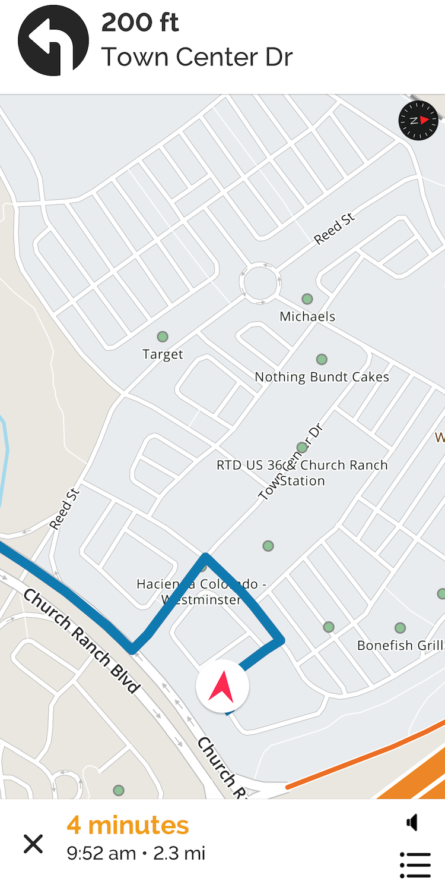

MapQuest Navigation Demo
========================

A simple navigation app designed for internal testing, to act as a reference design for customers, and to show off best UX practices for a navigation experience.

Building the Project
-----------------------

The project uses [CocoaPods](http://cocoapods.org/) to manage 3rd party
libaries. Pods are included with the source, but if you make any pod-related
changes, run the following (and commit the resulting changes):

    $ [sudo] sudo gem install cocoapods
    
And then install the pods via:

    $ pod install

Note that you must open the *workspace* file from now on, not the *project*
file. The workspace file is configured to build the pods and then our project,
which now depends on the pod archive.

    $ open MQNavigationDemo.xcworkspace
    
You'll have to add your MapQuest access key to the `MQApplicationKey`
field in Info.plist. Also, be sure to update your Bundle Identifier and Team
Identity.

MapQuest API Key
---------------------------

Get your MapQuest access key at <https://developer.mapquest.com>.

How to use this Project
---------------------------

This project has several components you can use as a basis for building your own MapQuest-based Navigation application. These areas are designed so that you can re-use the concepts and code in your own projects. The demo is heavily commented for your reading pleasure. The project can be separate into the following areas:

### Root User Interface

`RootViewController.swift` defines and sets up the basic user interface for the Navigation project. It is the delegate for `NavViewController` which allows it to respond to state changes:
        * Navigation Starting/Stopping
        * Updating UI for Manuever Text, ETA (estimated time of arrival), Warnings, Lane Guidance, Speed Limit
        * State of the map - whether its currently following the user's location/course or if the user has manually moved the map

The `RootViewController` also handles as a conduit between the Destination controller and the Navigation controller using the `DestinationUpdating` protocol.

### Map and Navigation Controller

`NavViewController` is the heart and soul of this demo. It defines a `NavViewControllerDelegate` to communicate with the `RootViewController`, works with the *MQNavigation* framework, and handles all navigation interaction.

The `NavViewController` uses the *MQNavigation* framework to request routes, based on a current location, a single destination, and trip options (avoid highway, tolls, etc). The resulting set of routes is then displayed as an overlay on the map. From there, we let the user select which route to use. When the user starts navigation, *MQNavigation* is again called to start navigation at which point `NavViewController` begins to receive delegate calls for:
        * Start/Stop Navigation
        * Location Updates
        * ETA/Traffic Updates
        * Traffic Reroute Requests
        * Speed Limit Changes
        * Reaching the Destination

The `NavViewController` also is a delegate for the `MQMapView` and lets the `RootViewController` know about UI changes changes that need occur when the user takes the map out of navigation mode. For example if the user pans or zooms, the `RootViewController` adds a _Recenter_ button to bring the map back into navigation mode.

We have broken all of the delegate calls into their own extensions separated by `//MARK: ` statements so you can easily find what you're looking for.

### Audio Prompts

The `MQNavigationManagerPromptDelegate` provides prompts to you that you can handle any way you want. In this demo app we use our `AudioManager` that utilizes iOS' `AVSpeechSynthesizer` for the actual speech. The `AudioManager` handles the volume, ducking, headphone, Bluetooth, and alert management for you.

### Search Ahead/Destination Controller

`SearchDestinationViewController` is a simple view controller with a UITableView that works with our MQSearchAhead framework. As you type in text, the MQSearchAhead is queried and the results are processed into an array that's passed using the `SearchParentProtocol` protocol back to the `RootViewController` and then to the `NavViewController`.

In the `SearchAheadOperation` class there is a `collections` property which refines the search results to : airports, addresses, POI (requires an Enterprise Edition API key), and franchises. You can add categories and admin areas - but those will return results with no location. However this can be useful if you wish to allow the search ahead to dig deeper into a specific type or area. For example if a result for "Sushi" returns "Sushi Restaurants" as a category, you might use that to limit the results to only Sushi restaurants. Please refer to the MQSearchAhead documentation for more information on these collections. Also note that the demo app does not handle category or admin area collections. `SearchAheadOperation` is a subclass of `SearchOperation` which you can use to create new search data sources.

_We are using the [Pulley library on Github ](https://github.com/52inc/Pulley) to create a drawer for the Search Ahead. Pulley is not affiliated with MapQuest._

### Annotations and Route overlays

Routes are generated as `MGLPolyline` overlays on the map. The `RouteAnnotator` class takes an `MQRoute` and enumerates the shape coordinates to create a colorful route based on being the selected or inactive route, or traffic. The `NavController` removes the old route from the map and then adds the new routes. The method that implements this is: `draw(routes: [MQRoute])`.

The destination annotation shows up as an image by responding to the `mapView(:imageFor:)` delegate call from `MQMapView`. To change the destination image, change the image returned in this method.

### Multi-stop Routes

Typically most people will drive from one location to the next, but occasionally they will setup a multi-stop route: Home -> Dry Cleaning -> Office. *MQNavigation* gives you control over what happens upon reaching each destination point. Within the demo app, the `NavViewController` notifies `RootViewController` that a destination was reached (if its not the final destination) and then it pauses navigation. Pausing navigation allows the user to select when they will continue upon the route. We set the text in the bottom view to let the user know that when they tap on the bottom view - it will resume navigation to the next destination.

Tapping on the next destination label on the main screen will bring up an alert asking if you'd like to advance to the next leg. This uses the `MQNavigationManager`'s `advanceRouteToNextLeg` method. The `MQNavigationManager` provides the current route and the current leg, but that doesn't provide you with the names of the destinations or other user-information. Your host app will need to keep its own state for destinations and calculate the appropriate user-pertinent information based on `MQNavigationManager`'s properties.

When writing a navigation app supporting multi-stop routes it is very important to keep the current leg of that route as a property and to not show previous legs in the instructions or route overlays. 

### Logging

Navigation generates lots of userful information that you may want to log for support purposes. The demo app includes a fully customizable `LoggingManager` that implements our `LoggingProtocol`. You can create your own manager based on the protocol or simply use the existing manager.

Further Documentation
---------------------------

For more information on the MapQuest Maps SDK, check out: <https://developer.mapquest.com/documentation/ios-sdk/>

For more information on the MapQuest Navigation SDK, check out:

For more information on the MapQuest SearchAhead SDK, check out: <https://developer.mapquest.com/documentation/searchahead-api/>
